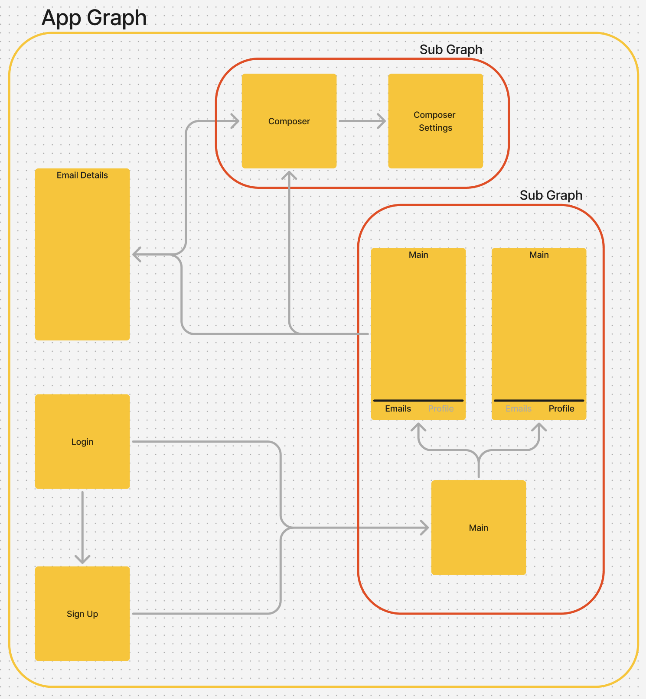

# nav-setup
Showcase Navigation

---

This project showcases the navigation setup.
It contains 3 branches:
## main - the initial app setup
## regular - completed navigation setup in regular (non-modularized) context
## modules - completed navigation setup in modularized context

### The Nav Graph
The NavGraph that this application is working on is shown below. It consists of a main nav graph and 2 subgraphs inside it

